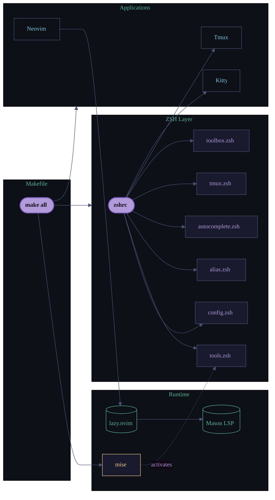

<div align="center">


> "You get what anybody gets. You get a lifetime. No more. No less."

# cosckoya/.dotfiles

**A self-contained, offline-capable Linux terminal environment built for speed.**

ZSH · Tmux · Neovim · Kitty — unified under a single Makefile.

[](https://opensource.org/licenses/MIT)
[](https://www.linux.org/)
[](https://www.zsh.org/)
[](#performance)
[](https://github.com/cosckoya/.dotfiles/actions)

</div>

---

## Quick Start

```bash
git clone https://github.com/cosckoya/.dotfiles.git ~/.dotfiles
cd ~/.dotfiles
make all        # mise + ZSH + Tmux + Kitty + Neovim
exec zsh        # reload shell (~80ms startup)
```

Selective install:

```bash
make help       # list all targets
make profile    # ZSH + Tmux + Kitty + Neovim (skip mise)
make zsh        # ZSH only
```

---

## Architecture



---

## Key Features

- **~80ms ZSH startup** — Zinit turbo mode with staggered async loading (`wait"1"`, `wait"2"`, `wait"3"`); compinit cached and invalidated daily; every module guarded for zero-penalty fallback
- **Unified visual identity** — Drizzt Do'Urden palette at WCAG AAA contrast (7:1+) across ZSH prompt, Tmux statusbar, Kitty, and Neovim
- **Contextual right-prompt** — Git branch via vcs_info, Python venv, Kubernetes context; falls back to `Klaatu Barada Nitko!` when none are active
- **Modular ZSH** — Six single-purpose modules under `zsh.d/`; every tool check uses `command -v` for graceful degradation
- **Native LSP in Neovim** — Mason-managed servers (Lua, Python, Bash) via lazy.nvim; no CoC, no npm/cargo/go runtime deps at startup
- **Offline-first** — All plugins installed locally; no external runtime calls on shell start

---

## Tech Stack

| Component | Technology | Version |
|-----------|------------|---------|
| Shell | ZSH + Zinit | 5.9+ |
| Terminal | Kitty | Latest stable |
| Multiplexer | Tmux | 3.2+ |
| Editor | Neovim (Lua) | 0.11+ |
| Runtime manager | mise | Latest |
| Plugin manager | lazy.nvim | Auto-bootstrapped |
| LSP installer | Mason | Auto-managed |
| Git hooks | pre-commit | 4.x |

---

## Project Structure

```
~/.dotfiles/
├── Makefile                    # symlink installer, idempotent
├── zshrc                       # entry point: module loader + Zinit bootstrap
├── zsh.d/
│   ├── config.zsh              # TMUX_AUTOSTART_* variables (user-editable)
│   ├── tools.zsh               # PATH management, editor chain, mise activation
│   ├── alias.zsh               # aliases and shell functions
│   ├── autocomplete.zsh        # lazy-loaded kubectl/helm/kind completions
│   ├── tmux.zsh                # Tmux helper functions
│   └── toolbox.zsh             # utility functions
├── config/
│   ├── tmux.conf               # Tmux 3.4+ native config
│   ├── kitty.conf              # GPU-accelerated terminal settings
│   └── nvim/
│       ├── init.lua            # bootstrap: lazy.nvim auto-install
│       └── lua/
│           ├── core/           # options.lua, keymaps.lua, autocmds.lua
│           └── plugins/        # lsp.lua, completion.lua, ui.lua, editor.lua
├── .pre-commit-config.yaml     # hooks: secret scan, YAML/Makefile lint, LF enforcement
├── .github/
│   └── workflows/ci.yml        # pre-commit, shell syntax, startup timer, Trivy scan
└── img/
    └── death.png               # visual asset
```

---

## Usage

### ZSH: Tmux auto-start

All variables live in `zsh.d/config.zsh` and can be overridden in the environment:

```bash
export TMUX_AUTOSTART_ENABLED="true"    # master switch
export TMUX_AUTOSTART_SESSION="dev"     # session name
export TMUX_SKIP_SSH="false"            # attach in SSH sessions
export TMUX_SKIP_IDE="true"             # skip inside VSCode / Emacs
export TMUX_SKIP_DESKTOP="true"         # skip in bspwm, i3, gnome, kde, xfce
```

### ZSH: lazy-loading pattern

Heavy completions use a self-removing wrapper to avoid blocking startup:

```zsh
_load_kubectl_completion() {
  source <(kubectl completion zsh)
  unfunction _load_kubectl_completion
  _load_kubectl_completion
}
compdef _load_kubectl_completion kubectl
```

### Neovim: adding a language server

```lua
-- config/nvim/lua/plugins/lsp.lua
local servers = { 'lua_ls', 'pyright', 'bashls', 'tsserver' }
```

Mason installs the server on next launch. No manual binary management.

---

## Performance

Target: ZSH prompt appears in under 110ms. Achieved: ~80ms on Ubuntu 22.04+.

```bash
time zsh -ic exit                                               # measure startup
zsh --startuptime /tmp/zsh.log -i -c exit && \
  sort -k2 -n /tmp/zsh.log | tail -20                          # profile modules
zsh -c 'source ~/.zshrc'                                        # validate syntax
tmux source ~/.tmux.conf                                        # reload tmux live
pre-commit run --all-files                                      # run all hooks
```

| Component | Target | Actual | Status |
|-----------|--------|--------|--------|
| ZSH startup | <110ms | ~80ms | pass |
| Tmux startup | <100ms | ~50ms | pass |
| Neovim startup | <500ms | ~300ms | pass |
| Pre-commit suite | <5s | <2s avg | pass |

---

## Color Reference

All components share a single palette derived from the Drizzt Do'Urden lore. Every value meets WCAG AAA (7:1+) against the `#100814` background.

| Role | Hex | 256-color | Used in |
|------|-----|-----------|---------|
| Background | `#100814` | — | Kitty, Tmux, Neovim |
| Lavender (violet eyes) | `#b19cd9` | 141 | ZSH border, Neovim Normal mode |
| Icy Blue (Twinkle) | `#7ec8e3` | 117 | ZSH hostname, git branch |
| Drow Green | `#5ab897` | 78 | Kubernetes context, Neovim Insert mode |
| Magical Yellow | `#f0c987` | 222 | ZSH separator, fallback RPROMPT |
| Red | `#d35d6e` | 167 | ZSH username |
| Inactive border | `#4a5273` | — | Tmux inactive panes |

Design tokens and extensibility rules: [`docs/design-system.dotfiles.md`](./docs/design-system.dotfiles.md)
Full palette, contrast ratios, and lore: [`docs/color-scheme.dotfiles.md`](./docs/color-scheme.dotfiles.md)

---

## Platform Requirements

**Tested:** Ubuntu 20.04+, Debian 11+

**Required:** `zsh 5.9+` · `git 2.40+` · `tmux 3.2+` · `make 4.3+`

**Optional (graceful fallback if absent):** `kubectl` · `helm` · `docker` · `npm` · `bat` · `fzf` · `ripgrep` · `xsel` · `wl-copy`

Neovim: `make install-nvim` (uses `sudo snap install nvim --classic`)

---

## Documentation

Full technical reference in [`docs/README.md`](./docs/README.md).

| Guide | Content |
|-------|---------|
| [Getting Started](./docs/getting-started.dotfiles.md) | Prerequisites, installation, first-run checklist |
| [ZSH](./docs/zsh.dotfiles.md) | Modules, env vars, prompt, Zinit plugins |
| [Tmux](./docs/tmux.dotfiles.md) | Keybindings, copy mode, clipboard |
| [Kitty](./docs/kitty.dotfiles.md) | Font, display settings, layouts |
| [Neovim](./docs/neovim.dotfiles.md) | Bootstrap, LSP servers, completion, keymaps |
| [Design System](./docs/design-system.dotfiles.md) | Design tokens, architecture layers, interaction patterns, extensibility contract |
| [Architecture](./docs/architecture.dotfiles.md) | Installation mechanics, startup flow |
| [Color Scheme](./docs/color-scheme.dotfiles.md) | Per-component usage, WCAG AAA contrast, lore |
| [Makefile](./docs/makefile.dotfiles.md) | Targets, symlink mechanics |
| [Pre-commit](./docs/pre-commit.dotfiles.md) | Hooks, configuration, CI integration |
| [Troubleshooting](./docs/troubleshooting.dotfiles.md) | Common issues and solutions |

---

## Contributing

```bash
git checkout -b feat/my-change
# pre-commit validates on commit: syntax, secrets, whitespace, LF endings
git commit -m "feat: description"
```

Open a PR against `main`. One approval required.

- [Contributing Guide](./CONTRIBUTING.md) — branch naming, commit format, PR checklist
- [Security Policy](./.github/SECURITY.md) — vulnerability disclosure

---

**License:** MIT — see [LICENSE](./LICENSE)
**Maintained by:** [Cosckoya](https://github.com/cosckoya)
