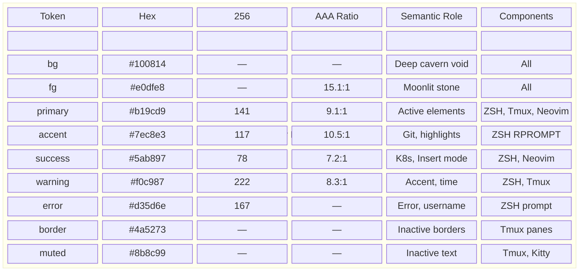
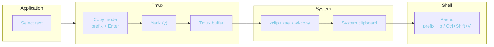
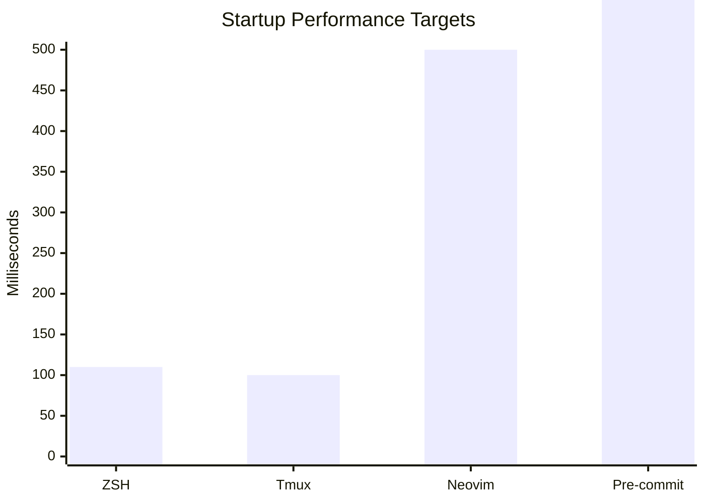
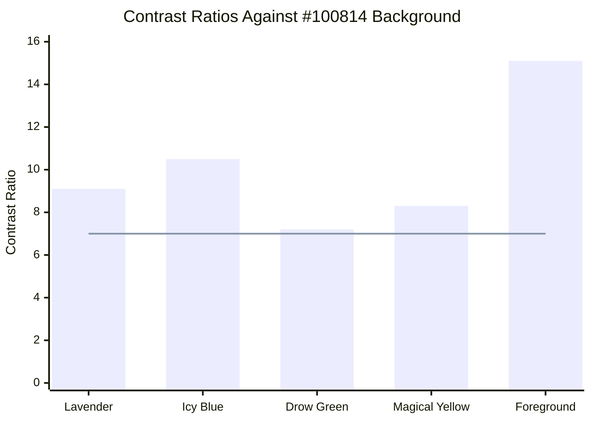

# Design System: The Underdark Realm

Unified design system for the cosckoya/.dotfiles ecosystem. This document is the single source of truth for visual tokens, architectural principles, interaction patterns, and the extensibility contract. All components — current and future — derive their design from this system.

---

## 1. Design Tokens

Atomic values shared across all components. Every color, font, space, and timing value is defined here.

### 1.1 Color



All colors meet WCAG AAA contrast (7:1+) against `#100814` background. See [Color Scheme](./color-scheme.dotfiles.md) for full lore, contrast methodology, and dircolors configuration.

### 1.2 Typography

| Token | Value | Component | Fallback |
|-------|-------|-----------|----------|
| `--font-mono` | `JetBrains Mono Nerd Font` | Kitty, Neovim | `monospace` |
| `--font-size` | `12pt` | Kitty | `system` |
| `--font-ligatures` | `enabled` | Kitty | `disabled` |
| `--font-size-status` | `system default` | Tmux | — |

Typography choices are functional: monospace for code, system font for tmux status to avoid rendering overhead.

### 1.3 Spacing

| Token | Value | Component | Usage |
|-------|-------|-----------|-------|
| `--window-padding` | `4px` | Kitty | Padding around terminal content |
| `--window-size` | `140x40` | Kitty | Default character grid |
| `--scrollback` | `50000` | Kitty | Lines kept in history |
| `--pane-border` | `1px` | Tmux | Pane separator width |

### 1.4 Opacity

| Token | Value | Component | Notes |
|-------|-------|-----------|-------|
| `--bg-opacity` | `0.88` | Kitty | Glass effect over compositor |

### 1.5 Animation & Timing

| Token | Value | Component | Purpose |
|-------|-------|-----------|---------|
| `--cursor-blink` | `0.5s` | Kitty | Cursor blink interval |
| `--status-interval` | `10s` | Tmux | Status bar refresh rate |
| `--escape-time` | `10ms` | Tmux | Key sequence detection window |

---

## 2. Architecture Layers

```mermaid
%%{init: {'theme': 'base', 'themeVariables': {
  'primaryColor': '#1a1a2e', 'primaryTextColor': '#b19cd9',
  'primaryBorderColor': '#4a5273', 'secondaryColor': '#100814',
  'secondaryTextColor': '#7ec8e3', 'tertiaryColor': '#0d1117',
  'tertiaryTextColor': '#5ab897', 'lineColor': '#4a5273',
  'background': '#100814'
}}}%%
flowchart LR
    subgraph HW["Hardware"]
        GPU["GPU"]:::hw
        CPU["CPU"]:::hw
    end
    subgraph OS["Operating System"]
        X11["X11 / Wayland"]:::os
        COMP["Compositor"]:::os
    end
    subgraph TERM["Terminal (Kitty)"]
        KW["Window Decorations"]:::term
        KF["Font & Colors"]:::term
        KI["Input Handling"]:::term
    end
    subgraph MUX["Multiplexer (Tmux)"]
        TS["Status Bar"]:::mux
        TP["Pane Management"]:::mux
        TB["Buffer / Clipboard"]:::mux
    end
    subgraph SHL["Shell (ZSH)"]
        ZP["Prompt"]:::shl
        ZC["Completions"]:::shl
        ZA["Aliases"]:::shl
    end
    subgraph EDT["Editor (Neovim)"]
        NS["Statusline"]:::edt
        NL["LSP"]:::edt
        NC["Completion UI"]:::edt
    end
    subgraph FUT["Future Components"]
        WM["Window Manager"]:::fut
        LR["Launcher"]:::fut
        SB["Waybar"]:::fut
    end

    HW --> OS --> TERM --> MUX --> SHL --> EDT
    MUX -.-> FUT
    TERM -.-> FUT

    classDef hw fill:#0d1117,stroke:#4a5273,color:#7ec8e3
    classDef os fill:#0d1117,stroke:#4a5273,color:#e0dfe8
    classDef term fill:#1a1a2e,stroke:#b19cd9,color:#b19cd9
    classDef mux fill:#1a1a2e,stroke:#b19cd9,color:#7ec8e3
    classDef shl fill:#1a1a2e,stroke:#b19cd9,color:#5ab897
    classDef edt fill:#1a1a2e,stroke:#b19cd9,color:#f0c987
    classDef fut fill:#100814,stroke:#4a5273,stroke-dasharray: 5 5,color:#8b8c99
```



### Layer Responsibilities

Each layer owns specific visual and behavioral concerns:

| Layer | Owns | Inherits |
|-------|------|----------|
| **Kitty** | Background opacity, font rendering, window chrome, cursor | OS theming (compositor) |
| **Tmux** | Pane borders, status bar, clipboard bridge, session management | Kitty's colors and font |
| **ZSH** | Prompt layout, command completions, aliases, editor selection | Tmux's terminal environment |
| **Neovim** | Mode indicators, LSP UI, file navigation | ZSH's `$VISUAL` and `$EDITOR` |

Future components (window manager, launcher, bar) sit between the OS and Kitty layer, inheriting the color palette and spacing tokens.

---

## 3. Component Specifications

### 3.1 ZSH Prompt

```mermaid
%%{init: {'theme': 'base', 'themeVariables': {
  'primaryColor': '#1a1a2e', 'primaryTextColor': '#b19cd9',
  'secondaryColor': '#100814', 'lineColor': '#4a5273',
  'tertiaryColor': '#0d1117', 'tertiaryTextColor': '#5ab897'
}}}%%
flowchart LR
    subgraph LEFT["Left Prompt (Static)"]
        B1["┌──("]:::border
        H["hostname"]:::host
        S["の"]:::sep
        U["user"]:::user
        B2[")"]:::border
        NL1["<br>└─#"]:::border
    end
    subgraph RIGHT["Right Prompt (Dynamic, priority ordered)"]
        GIT["Git branch"]:::git
        VENV["Python venv"]:::venv
        K8S["K8s context"]:::k8s
        FALLBACK["Klaatu Barada Nitko!"]:::fallback
    end

    LEFT --> RIGHT

    classDef border color:#b19cd9
    classDef host color:#7ec8e3
    classDef sep color:#f0c987
    classDef user color:#d35d6e
    classDef git color:#7ec8e3
    classDef venv color:#b19cd9
    classDef k8s color:#5ab897
    classDef fallback color:#f0c987
```



**Left prompt** — static identification:

```
┌──(hostname の username)
└─#
```

**Right prompt** — dynamic context in priority order: Git branch > Python venv > Kubernetes context > fallback message.

**Fallback string:** `Klaatu Barada Nitko!` (yellow) — appears when no git, venv, or k8s context is active. A reference to the army of the dead in *Army of Darkness*, representing a shell awaiting purpose.

### 3.2 Tmux Status Bar

```
 Left: [session icon] session_name
 Right: PREFIX indicator (yellow when active) | HH:MM | username (yellow) | hostname (lavender)
```

- Active pane border: `#b19cd9` (lavender) — `primary`
- Inactive pane borders: `#4a5273` (cavern stone) — `border`
- Status bar background: `#100814` — `bg`
- Active window tab: `#b19cd9` background, `#100814` text
- Session name hidden when named `default`

### 3.3 Kitty Window

- Background: `#100814` at 0.88 opacity (glass effect)
- Foreground: `#e0dfe8`
- Cursor: `#b19cd9` beam shape, 0.5s blink
- Active window border: `#b19cd9`
- Inactive window border: `#3d4466`

### 3.4 Neovim Mode Indicators

| Mode | Statusline Color | Token |
|------|-----------------|-------|
| Normal | `#b19cd9` (lavender) | `primary` |
| Insert | `#5ab897` (drow green) | `success` |
| Visual | `#7ec8e3` (icy blue) | `accent` |

---

## 4. Interaction Design

### 4.1 Keybinding Philosophy

| Modifier Convention | Scope | Examples |
|-------------------|-------|----------|
| `Ctrl+Shift+key` | Terminal (Kitty) | Split, new tab, copy/paste, reload |
| `prefix + key` | Multiplexer (Tmux) | Pane navigation, window management, copy mode |
| `leader-key` | Editor (Neovim) | Code actions, rename, file finder |
| `Ctrl+arrow` | Pane navigation (Tmux, no prefix) | Quick focus without prefix key |

**Navigation — vim-style `hjkl` across layers:**

- Tmux panes: `prefix + h/j/k/l`
- Tmux panes (no prefix): `Ctrl+h/j/k/l`
- Neovim: native `h/j/k/l`
- Tmux resize: `prefix + H/J/K/L`

All navigation follows the same directional logic: `h`=left, `j`=down, `k`=up, `l`=right.

### 4.2 Copy/Paste Flow



Tmux copy mode automatically bridges to the system clipboard. No manual `xclip` piping needed.

### 4.3 Mode Awareness

The system signals state through color:

| Visual Cue | Indicates | Component |
|-----------|-----------|-----------|
| Lavender statusline | Neovim Normal mode | Neovim |
| Green statusline | Neovim Insert mode | Neovim |
| Yellow `PREFIX` | Tmux prefix active | Tmux |
| Yellow RPROMPT | No context active (fallback) | ZSH |

---

## 5. Performance Contract

### 5.1 Budgets



| Component | Target | Measured | Method |
|-----------|--------|----------|--------|
| ZSH | <110ms | ~80ms | `time zsh -ic exit` |
| Tmux | <100ms | ~50ms | `tmux new-session -d; time tmux kill-session` |
| Neovim | <500ms | ~300ms | `nvim --startuptime /tmp/nvim.log -c exit` |
| Pre-commit | <5s | <2s avg | `time pre-commit run --all-files` |

### 5.2 ZSH Startup Profile

```mermaid
gantt
    title ZSH Startup Timeline
    dateFormat X
    axisFormat %s
    section Synchronous
    config.zsh        : 0, 1
    Tmux auto-start   : 1, 6
    Zinit bootstrap   : 6, 16
    History & options : 16, 18
    Tool modules      : 18, 33
    Prompt & vcs_info : 33, 38
    Compinit cache    : 38, 58
    section Async
    kubectl-prompt    : 0, 1000
    autosuggestions   : 0, 2000
    zsh-completions   : 0, 2000
    syntax-highlight  : 0, 3000
```



Optimization principles:

- **Lazy-load everything non-essential** — completions, async plugins
- **Cache aggressively** — compinit dump regenerated daily, not per-session
- **Fail fast on missing tools** — `command -v` guard before any tool call
- **No network on startup** — all plugins pre-installed locally

### 5.3 Measurement Commands

```bash
# ZSH startup time
time zsh -ic exit

# ZSH profiling
zsh --startuptime /tmp/zsh.log -i -c exit && sort -k2 -n /tmp/zsh.log | tail -20

# ZSH syntax validation
zsh -n zshrc

# Makefile validation
make help

# All pre-commit hooks
pre-commit run --all-files
```

---

## 6. Accessibility

### 6.1 WCAG AAA Compliance

**Hard constraint:** All foreground text against the `#100814` background must meet WCAG AAA (7:1) contrast ratio.



The line at 7.0 marks the WCAG AAA threshold. All colors exceed it.

### 6.2 Verification

```bash
# Check any foreground color against background
contrast_ratio() {
  local fg="$1" bg="${2:-#100814}"
  python3 -c "
from colormath.color_objects import sRGBColor, LabColor
from colormath.color_conversions import convert_color
def relative_luminance(hex_color):
    r, g, b = [int(hex_color[i:i+2], 16)/255.0 for i in (1, 3, 5)]
    r = r/12.92 if r <= 0.03928 else ((r+0.055)/1.055)**2.4
    g = g/12.92 if g <= 0.03928 else ((g+0.055)/1.055)**2.4
    b = b/12.92 if b <= 0.03928 else ((b+0.055)/1.055)**2.4
    return 0.2126*r + 0.7152*g + 0.0722*b
l1 = relative_luminance('$fg')
l2 = relative_luminance('$bg')
ratio = (max(l1,l2)+0.05)/(min(l1,l2)+0.05)
print(f'{ratio:.1f}:1')
print('Pass AAA' if ratio >= 7 else 'FAIL AAA')
"
}
contrast_ratio $1
```

---

## 7. Extensibility Contract

The design system's purpose is to remain the single source of truth as the ecosystem grows. Follow these rules when extending.

### 7.1 Adding a New Component

Every new component (e.g., bspwm, rofi, waybar, polybar) **MUST**:

1. **Inherit color tokens** — use `primary`/`accent`/`success`/`warning`/`error`/`bg`/`fg` from section 1.1. Map to the component's config format (hex, 256-color, etc.).
2. **Respect spacing tokens** — use `--window-padding` or equivalent for consistent whitespace.
3. **Use the font stack** — JetBrains Mono Nerd Font where monospace is appropriate, system font for UI elements.
4. **Obey opacity constraints** — do not exceed 0.88 background opacity for glass effects. Use solid `#100814` for opaque elements.
5. **Pass WCAG AAA** — all text against background must meet 7:1 minimum contrast.
6. **Document in design-system only** — add a row to the component specification table. Do not create separate design docs.

**Example — adding bspwm:**

```
Border colors:      primary (active window), border (inactive)
Focus indicator:    accent (icy blue)
Urgency:            error (red)
Title font:         system (no monospace in window titles)
```

### 7.2 Adding a New Color Token

1. Verify it's truly needed — can an existing token serve the purpose?
2. If yes, add to section 1.1 Master Palette table.
3. Verify WCAG AAA contrast against `#100814` (7:1 minimum).
4. Map to 256-color index if ZSH needs it.
5. Add a row to the Per-Component Usage table for each component that uses it.
6. Do NOT add the same hue with different lightness — use opacity instead.

### 7.3 Adding a New Keybinding

1. Identify the correct modifier convention (section 4.1).
2. If it's a tmux binding, add to `config/tmux.conf` and document in `docs/tmux.dotfiles.md`.
3. If it's an editor binding, add to `config/nvim/lua/core/keymaps.lua`.
4. Apply the `hjkl` navigation convention if directional.
5. Do not conflict with existing bindings — check the component's doc first.

### 7.4 Golden Rules

- **No duplication** — a color value lives in one place (this document). Components reference tokens by name.
- **No runtime network** — all assets installed locally. Startup never fetches.
- **Graceful fallbacks** — every tool check uses `command -v`. Missing tools never block.
- **Symlinks, not copies** — changes to repo files take effect immediately in the running system.
- **Performance budget first** — a feature that violates the startup budget must be lazy-loaded or omitted.
- **One source of truth** — `design-system.dotfiles.md` owns design. `CLAUDE.md` owns project guidance. Executable config (Makefile, CI, pre-commit) overrides docs if they conflict.

---

## 8. File Organization

| Path | Role |
|------|------|
| `docs/design-system.dotfiles.md` | Design tokens, architecture, interaction, contracts |
| `docs/color-scheme.dotfiles.md` | Lore, dircolors, contrast methodology (references tokens from design-system) |
| `docs/architecture.dotfiles.md` | Makefile mechanics, startup flow detail (references principles from design-system) |
| `docs/zsh.dotfiles.md` | ZSH module reference, performance troubleshooting |
| `docs/tmux.dotfiles.md` | Tmux keybindings, session commands |
| `docs/kitty.dotfiles.md` | Kitty settings, layout reference |
| `docs/neovim.dotfiles.md` | Neovim LSP, plugin config |
| `CLAUDE.md` | Project overview, agent guidance |
| `README.md` | Public-facing project description |

---

*"You get what anybody gets. You get a lifetime. No more. No less."* — Death of the Endless
